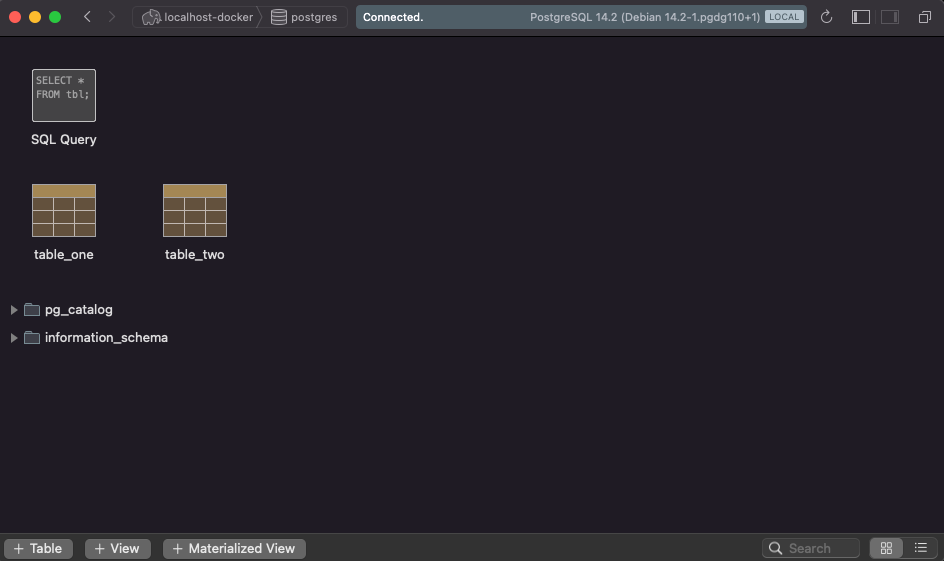

# Docker Persistenz anhand von Postgres Image
Docker Container werden üblicherweise ohne Persistenz ausgeführt. Das hat zur Folge, dass persistente Änderungen nach dem Stoppen und Starten eines Containers nicht mehr verfügbar sind. Um dies zu umgehen und damit persistente Änderungen zu erhalten betrachten wir in dieser Übung Docker Volumes.

## Prerequisite
* Docker
* (PostgreSQL DB Explorer Client) optional

## Postgres Image
In dem [Dockerfile](https://github.com/coc-university/docker-basics/blob/main/postgres/Dockerfile) wird das `postgres:14.2` Image erweitert und ein Admin User `postgres` sowie ein Admin Password `Admin#P4ssw0rd` definiert. Das passiert wiederum über Environment Variablen.

`ENV POSTGRES_USER="postgres"`

`ENV POSTGRES_PASSWORD="Admin#P4ssw0rd"`

Da das Basis-Image bereits den korrekten Start Befehl definiert hat und den Port `5432` freigibt, müssen wir an dem Image keine weiteren Änderungen vornehmen. Wie gewohnt bauen wir das Image und versehen es mit einem Tag.

`docker build --tag=postgres-test .`

Anschließend starten wir einen Docker Container aus diesem Image und achten darauf, den Port freizugeben.

`docker run -p 5432:5432 postgres-test`

## Verbinden mit Container und Datenbank anlegen (optional)
`Der folgende Schritt dient nur der Veranschaulichung des Problems fehlender Persistenz. Für das Konfigurieren des Volumes kann man diesen Schritt überspringen.`

Verbindet man sich mit einem Postgres SQL Explorer gegen die Datenbank, kann man nun Tabellen oder Datenbanken anlegen. Stoppt man den Container und startet ihn erneut, sind diese Tabellen oder Datenbanken nicht mehr vorhanden und müssen neu angelegt werden.  



## Persistenz
Das Postgres Image speichert persistente Daten per default in dem Pfad `/var/lib/postgresql/data`. Es gilt jetzt vom Host einen Pfad in den Docker Container zu mounten, damit die Daten auch einen Container stop/restart überdauern. Dafür haben wir mehrere Möglichkeiten.

### Anonymous Volumes
Wir geben Docker beim Start den Befehl ein Volume für uns zu erstellen. Das Volume wird zwar nicht den Restart überdauern, da es nur temporär ist. Allerdings könnten wir hiermit schon auf dem Host debuggen.

`docker run -p 5432:5432 -v /var/lib/postgresql/data postgres-test`

* `-v /var/lib/postgresql/data` wird Docker mitteilen ein Volume zu erstellen

`docker inspect <container-id>` gibt uns dann die Information, wo auf dem Host das temporäre Volume zu finden ist.

``` 
{
  ... ,
  
  "Mounts": [
    {
      "Type": "volume",
      "Name": "bd39971f96fc6ac948cde889c4cea0a042616e4c502e5491b6587482ac119bd8",
      "Source": "/var/lib/docker/volumes/bd39971f96fc6ac948cde889c4cea0a042616e4c502e5491b6587482ac119bd8/_data",
      "Destination": "/var/lib/postgresql/data",
      "Driver": "local",
      "Mode": "",
      "RW": true,
      "Propagation": ""
    }
  ],
  
  ...
}
```
Da unser Ziel aber ist, ein Volume zu definieren, welches einen Restart überdauert schauen wir uns die nächsten Schritte an.

### Named Volumes
Wir können ein Named Volume erstellen und anschließend in den Docker Container mounten.

`docker volume create psql-volume`

Ebenfalls können wir über Docker inspect einsehen, wo Docker auf dem Host das Volume ablegt.

`docker volume inspect psql-volume`

```
[
  {
    "CreatedAt": "2022-03-08T14:08:00Z",
    "Driver": "local",
    "Labels": {},
    "Mountpoint": "/var/lib/docker/volumes/psql-volume/_data",
    "Name": "psql-volume",
    "Options": {},
    "Scope": "local"
  }
]
```

Nun starten wir den Postgres Container und geben das erstellte Volume als Parameter mit.

`docker run -p 5432:5432 -v psql-volume:/var/lib/postgresql/data postgres-test`

* `-v psql-volume:/var/lib/postgresql/data` mounted das erstellte `psql-volume` Volume als Source und verknüpft es mit dem Target Path

Wenn wir nun Tabellen oder neue Datenbanken erstellen, bleiben diese persistiert - auch nach einem Container Restart.

### Bind Mounts

Es gibt noch eine weitere Möglichkeit Volumes zu mounten. Die Bind Mounts erlauben es uns, bestimmte Pfade vom Host direkt in den Container zu mounten. Diese überdauern ebenfalls einen Container Restart.

`docker run -p 5432:5432 -v $PWD/my/local/path:/var/lib/postgresql/data postgres-test`

* `-v $PWD/my/local/path:/var/lib/postgresql/data` mounted den angegebenen Host-Pfad an den Target Pfad des Containers

Im Endeffekt, ist das Konzept vergleichbar mit dem des Named Volumes, wir haben nur mehr Freiheit den Pfad auf dem Host System zu bestimmen.

### Prüfen welche Volumes vorhanden sind und löschen dieser
* `docker volume ls` Welche Volumes sind auf dem Host vorhanden
* `docker volume rm <id>` Löscht das Volume mit der <id>
